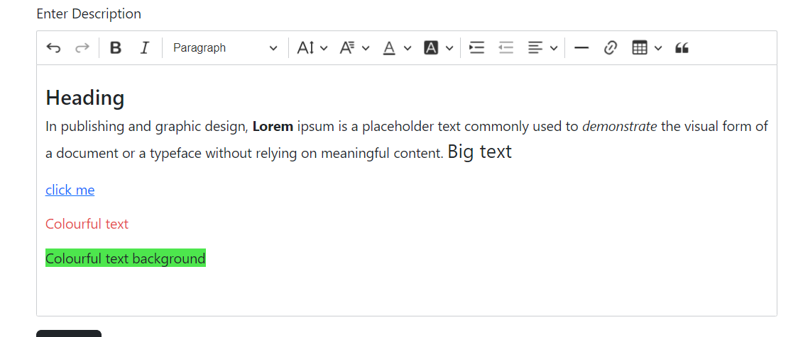

# Html-CkEditor-spring-boot

CKEditor is a WYSIWYG rich text editor which enables writing content directly inside of web pages or online applications.<br />

Important Links : 
- [MARKDOWN-OUTPUT CKEditor Repository](https://github.com/suraj-repositories/Markdown-CkEditor-spring-boot)
- [Ck Editor 5 download/cdn/npm](https://ckeditor.com/ckeditor-5/download/#zip)
- [Official Website](https://ckeditor.com/)

<div align="center">

</div>

## Steps

### Using CDN

1. When you are using CDN you need to add the following stylesheet in your html head section

```html
    <link rel="stylesheet" href="https://cdn.ckeditor.com/ckeditor5/42.0.1/ckeditor5.css" />
```
2. Add the javascript needed (Make sure to paste the code in html or php files not on js file)

```html
<script type="importmap">
        { 
            "imports": {
                "ckeditor5": "https://cdn.ckeditor.com/ckeditor5/42.0.1/ckeditor5.js",
                "ckeditor5/": "https://cdn.ckeditor.com/ckeditor5/42.0.1/"
            }
        }
</script>
```

3. The next step is to add needed plugins and customize your ckeditor according to your need
    <br>The basic One : 
    
```html

        <script type="module">
            import {
                ClassicEditor,
                AccessibilityHelp,
                Alignment,
                AutoLink,
                Autosave,
                BlockQuote,
                Bold,
                CodeBlock,
                Essentials,
                Font,
                GeneralHtmlSupport,
                Heading,
                HorizontalLine,
                Indent,
                IndentBlock,
                Italic,
                Link,
                Paragraph,
                SelectAll,
                Style,
                Table,
                TableCaption,
                TableCellProperties,
                TableColumnResize,
                TableProperties,
                TableToolbar,
                Undo
            } from 'ckeditor5';

            let ckEditors = document.querySelectorAll(".ckeditor");

            ckEditors.forEach((editor) => {
                ClassicEditor
                    .create(editor, {
                        plugins: [AccessibilityHelp, Alignment,
                            AutoLink,
                            Autosave,
                            BlockQuote,
                            Bold,
                            CodeBlock,
                            Essentials,
                            Font,
                            GeneralHtmlSupport,
                            Heading,
                            HorizontalLine,
                            Indent,
                            IndentBlock,
                            Italic,
                            Link,
                            Paragraph,
                            SelectAll,
                            Style,
                            Table,
                            TableCaption,
                            TableCellProperties,
                            TableColumnResize,
                            TableProperties,
                            TableToolbar,
                            Undo
                        ],
                        toolbar: {
                            items: ['undo',
                                'redo',
                                '|',
                                'bold',
                                'italic',
                                '|',
                                '|',
                                'heading',
                                '|',
                                'fontSize',
                                'fontFamily',
                                'fontColor',
                                'fontBackgroundColor',
                                '|',
                                'indent',
                                'outdent',
                                'alignment',
                                '|',
                                'horizontalLine',
                                'link',
                                'insertTable',
                                'blockQuote',
                                '|',


                            ]

                        }
                    })
                    .then(editor => {
                        window.editor = editor;
                    })
                    .catch(error => {
                        console.error(error);
                    });
            });
</script>
```

4. After this you are able to use the ckeditor - To use this 
    - Where-ever you want to use ckeditor : you need to add a class `ckeditor` on the element
    
```html
<textarea class="form-control ckeditor" name="description" id="editor" cols="30" rows="5"></textarea>
```

5. Tip : It will shows a logo at bottom-right corner : To remove that logo use the collowing code 

```html
<style>
    .ck-powered-by {
        display: none !important;
    }
</style>
```

6. Before store the data into the database it is very important to do some sanitization to pretend XSS attacks
  - in the given example i make use of `jsoup` to sanitize the html content 

```xml
<dependency>
    <groupId>org.jsoup</groupId>
    <artifactId>jsoup</artifactId>
    <version>1.15.3</version>
</dependency>
```
  - the above dependency make `jsoup` available for you
  - you need to configure `jsoup` according to your need : the needed settings for this demo is mentioned at `/Html-CKEditor-spring-boot/src/main/java/com/on5Aug/services/HtmlSanitizer.java`
  - after configuration you can use the sanitize method to sanitize your HTML content
  
  ```java
  todo.setDescription(HtmlSanitizer.sanitize(todo.getDescription())); // sanitizing the input
  ```
  - only save the data after sanitization to ensure security against XSS attacks

7. If you are using `thymeleaf` there is how to show the stored content as HTML on your view :: use `th:utext` to show output

```html
<div th:utext="${todo.description}"></div>
```

### Using Local setup for CKEditor

1. downlad the ckeditor : [Ck Editor 5 download/cdn/npm](https://ckeditor.com/ckeditor-5/download/#zip)
  
2. after Extracting the zip file : find the directory named ckeditor5 copy this directory as  `/Html-CKEditor-spring-boot/src/main/resources/static/ckeditor5`

3. create a `ckeditor-config.js` file in your static directory for configuration related to CKEditor<br/>
 you can view my config file at : `/Html-CKEditor-spring-boot/src/main/resources/static/ckeditor-config.js`

4. If you copyied the `ckeditor5` directory directly to `/Html-CKEditor-spring-boot/src/main/resources/static` directory : here is how to use perform local imports

```html
<link rel="stylesheet" th:href="@{/ckeditor5/ckeditor5.css}" />

<script type="importmap">
	   {
	       "imports": {
	           "ckeditor5": "./ckeditor5/ckeditor5.js",
	           "ckeditor5/": "./ckeditor5/"
	       }
	   }
</script>

<script type="module" th:src="@{/ckeditor-config.js}"></script>
```

5. The next steps are same to using CDN Follow the steps 4 to 7 

## Important  

- Make sure to Create bean of `HiddenHttpMethodFilter` if you want to send requests other than `GET` or `POST`
- After saving your data when retrieve you need to add styles on your classes used in ckeditor <br/>
  for example i use `Tiny Text` it just add a class to my element  : i have to specify the meaning of that class in my stylesheet : in that case when apply `Tiny Text` it will add a class `tiny-text` so we need to do something in our stylesheet
 
```css
    .tiny-text{
    	font-size : 0.7rem;
    }
```

### Files where I made changes
 
 - In the whole package : `/Html-CKEditor-spring-boot/src/main/java/com/on5Aug`
 - In the template directory : `/Html-CKEditor-spring-boot/src/main/resources/templates`
 - In the static directory : `/Html-CKEditor-spring-boot/src/main/resources/static`
 - for database related configs : `/Html-CKEditor-spring-boot/src/main/resources/application.properties`

<br />
<br />
<p align="center">⭐️ Star my repositories if you find it helpful.</p>
<br />
